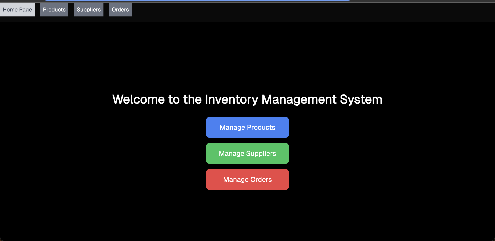
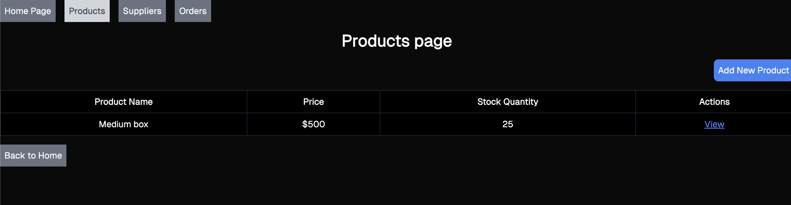
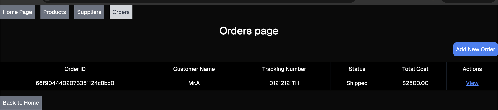
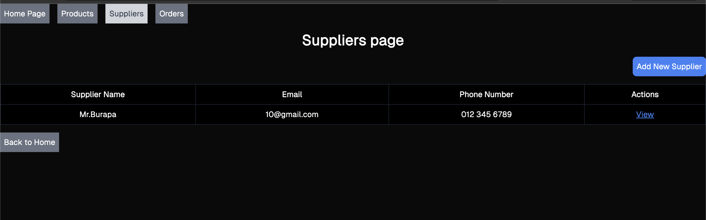

Project Name
Inventory Management System

Team Members
Burapa Jerdnapapornpun 6113143 https://github.com/653000000000?tab=repositories

Project Description
The Inventory Management System is a web application designed to help businesses efficiently manage their products, suppliers, and orders. The system includes features like:

Product Management: Add, edit, delete, and view product details including stock quantity and associated suppliers.

Supplier Management: Track suppliers' contact information and their associated products.

Order Management: Create and manage orders, update order status, and track order information, including customer details and product quantities. Optionally add tracking numbers for shipped orders.

The project uses Next.js for the frontend and MongoDB for the database. It implements a REST API to handle CRUD operations for three primary entities: Products, Suppliers, and Orders.

Screenshots
Home Page

Product Management Page

Order Management Page

Supplier Management Page

Features
Add, edit, delete, and view products.
Add, edit, delete, and view suppliers.
Add, edit, delete, and view orders with tracking numbers and product quantities.
Update stock quantities based on order fulfillment.

How to Run the Project
Clone the repository:

git clone https://github.com/653000000000/inventory-management.git
cd inventory-management

Install the dependencies:

npm install
Set up your environment variables: Create a .env.local file and add your MongoDB connection string.

Run the development server:

npm run dev
Open http://localhost:3000 in your browser.

Deployment
The project is deployed on Vercel. You can visit the live version here: https://inventory-management-swart-ten.vercel.app/